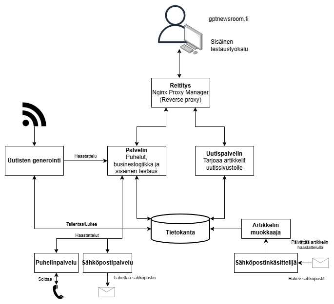
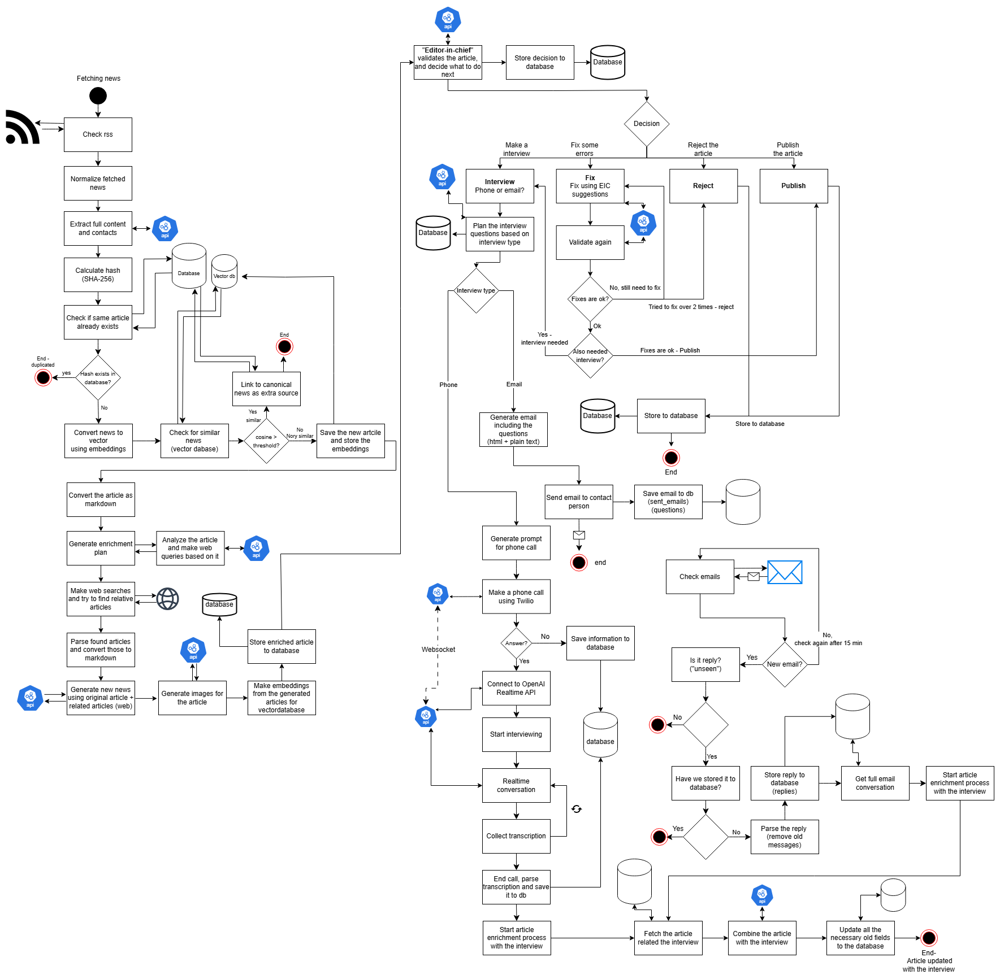
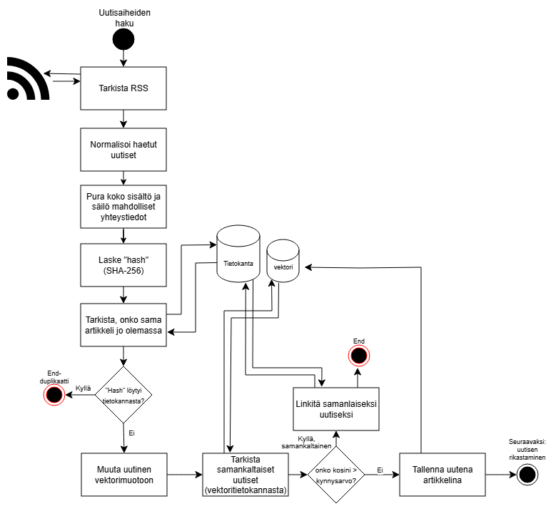
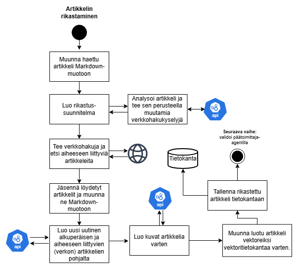
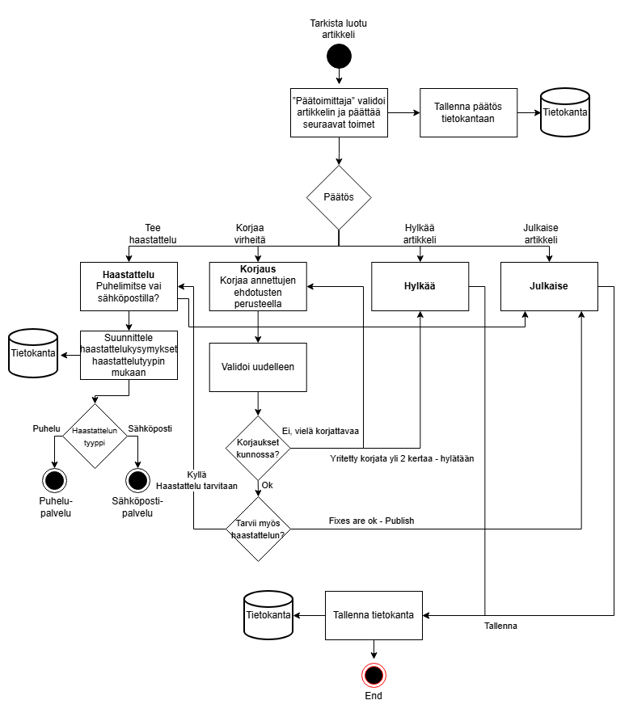
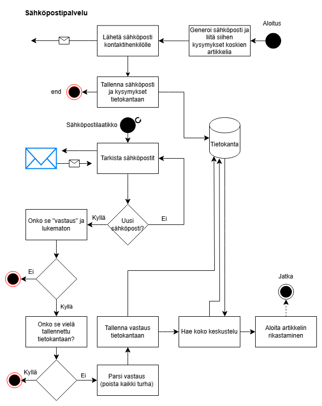
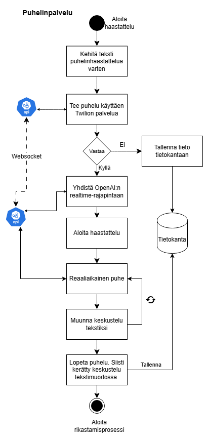

# Newsroom AI Pipeline

An automated, multi-agent newsroom pipeline that:
- Fetches and deduplicates fresh articles from configured RSS feeds.
- Plans news coverage and runs targeted web searches to enrich context.
- Generates enriched articles (text + images) using LLM + image APIs.
- Extracts contacts and plans / executes interviews (email + phone via Twilio).
- Supports asynchronous email reply enrichment.
- Runs a structured editorial review loop (publish / interview / revise / reject) with revision validation.
- Publishes approved articles (embeddings + metadata) into PostgreSQL (pgvector) for downstream retrieval via GraphQL / REST.

## High-Level Architecture

```
                ┌────────────────────────────────────────────────────┐
 RSS Feeds ---> │ FeedReaderAgent                                    │
                └──────────────┬─────────────────────────────────────┘
                               ▼
                      ArticleContentExtractorAgent
                               ▼
                      ContactsExtractorAgent
                               ▼
                          NewsStorerAgent  (hash + embedding dedupe)
                               ▼
                           NewsPlannerAgent (LLM planning)
                               ▼
                            WebSearchAgent (context enrichment)
                               ▼
                        ArticleGeneratorAgent (LLM drafting)
                               ▼
                     ArticleImageGeneratorAgent (Pixabay / Runware)
                               ▼
                         ArticleStorerAgent (store enriched draft)
                               ▼
                  ┌───────────────────────────────────────────┐
                  │           Editorial Subgraph              │
                  │  EditorInChiefAgent → decision:           │
                  │   publish | interview | revise | reject   │
                  │        ├─────────┐──────────┐            │
                  │        ▼         ▼          ▼            │
                  │  InterviewPlanningAgent  ArticleFixerAgent│
                  │        │ (email/phone)        │           │
                  │        ▼                      ▼           │
                  │  EmailInterviewExecution  FixValidationAgent
                  │  PhoneInterviewExecution      │             │
                  │        ▼                      │             │
                  │      (back) <───────────── revise / reject  │
                  │        │                      │             │
                  │   publish/interview ───────► ArticlePublisher│
                  │                       reject ─► ArticleReject │
                  └───────────────────────────────────────────┘
                               ▼
                           GraphQL / REST (backend + graphql services)
                               ▼
                       External Frontends / Consumers
```

Separate background component: `email_processor.py` runs periodically (cron-like) to ingest interview email replies and enrich existing articles.

## Repositories / Code Layout (Top-Level)

| Path | Purpose |
|------|---------|
| `agents/` | All agent implementations (fetching, planning, generation, editorial loop, interviews). |
| `services/` | Database service helpers (e.g., `editor_review_service.py`, article storage). |
| `schemas/` | Pydantic schema models for state, articles, reviews, feeds. |
| `api/` | FastAPI backend (admin endpoints, Twilio callbacks). |
| `news_graphql/` | GraphQL schema and resolvers for serving published content. |
| `database/initdb/` | SQL initialization scripts (tables, pgvector enablement). Mounted into the db container. |
| `static/` | Image / asset storage (mounted into containers). |
| `Dockerfile.*` | Service-specific container build definitions. |
| `docker-compose.yml` | Orchestrates Postgres (pgvector), backend, GraphQL, agents, Nginx Proxy Manager. |
| `.env_example` | Template for required environment variables. Copy to `.env`. |
| `email_processor.py` | Background email reply ingestion & enrichment. |
| `main.py` | Entry point running the multi-agent pipeline loop. |

## Core Data Flow

1. `FeedReaderAgent` fetches RSS feeds efficiently (If-Modified-Since / ETag) and appends new `CanonicalArticle` objects to `AgentState.articles`.
2. `ArticleContentExtractorAgent` normalizes / extracts full article content.
3. `ContactsExtractorAgent` pulls potential spokesperson / contact info.
4. `NewsStorerAgent` stores canonical articles applying hash & semantic embedding dedupe (pgvector `<=>` distance). Links semantic near-duplicates as sources instead of re-inserting full content.
5. `NewsPlannerAgent` uses LLM to decide coverage angles / queries; `WebSearchAgent` adds external corroboration / context.
6. `ArticleGeneratorAgent` creates enriched draft (title + body); `ArticleImageGeneratorAgent` attaches image(s) via Runware API, falling back to Pixabay.
7. `ArticleStorerAgent` writes enriched draft to DB and prepares `enriched_articles` for editorial review.
8. Editorial Subgraph (per article):
   - `EditorInChiefAgent` issues decision: publish / interview / revise / reject.
   - `InterviewPlanningAgent` shapes interview questions (email or phone). Execution via `EmailInterviewExecutionAgent` or `PhoneInterviewExecutionAgent`.
   - Email replies (later) are ingested by `email_processor.py` and enrichment logic.
   - `ArticleFixerAgent` produces revision commits; `FixValidationAgent` ensures requested corrections were implemented (max 2 revision cycles; then auto reject).
   - `ArticlePublisherAgent` marks final status = published + stores embedding.
   - `ArticleRejectAgent` marks status = rejected and persists reasoning.
9. `graphql_server.py` exposes published articles via Strawberry GraphQL; `server.py` exposes admin & Twilio endpoints via FastAPI.

## Editorial Loop & State

The editorial loop is implemented as a LangGraph `StateGraph` subgraph (`create_editorial_subgraph()` in `main.py`). Each node receives and returns an `AgentState`. Conditional routing is performed via functions that read decisions from `state.review_result`. Revision validation logic stops after 2 failed attempts by setting `editorial_decision = "reject"` which routes to `ArticleRejectAgent`.

## Interview Flow (Email + Phone)

- Planning: `InterviewPlanningAgent` determines if interview is needed and chooses method.
- Email: Generates question set, sends email. Replies are parsed by `email_processor.py` (imap) and enriched back into the article context.
- Phone: Twilio callback endpoints handled by `api/twilio/phone_service.py` (served from `server.py`).

## Image Generation

Primary: Runware API (AI generated). Fallback: Pixabay if Runware images not available or fail. Result paths written under `STATIC_FILE_PATH` (must be writable and mounted into containers).

## Embeddings & Vector Search

- SentenceTransformer (`paraphrase-multilingual-MiniLM-L12-v2`) encodes canonical and enriched content.
- Stored in `news_article.embedding` (vector column) and `canonical_news.content_embedding`.
- Similarity / distance: pgvector `<=>` operator used for duplicate detection and potential semantic reuse.

## Email Enrichment

`email_processor.py` runs on an interval (standalone container or background thread when executed separately). It:
1. Connects IMAP (Gmail) using env credentials.
2. Fetches recent unseen replies.
3. Parses clean reply text.
4. Resolves thread & questions for original interview email.
5. Calls integration to enrich the linked news article (adds context / quotes).

## Environment Variables

Copy `.env_example` to `.env` and fill values:
- OpenAI: `OPENAI_API_KEY`
- Database: `DB_HOST`, `DB_PORT`, `DB_NAME`, `DB_USER`, `DB_PASSWORD`, `DATABASE_URL`
- Email (Gmail): `EMAIL_ADDRESS_GMAIL`, `EMAIL_PASSWORD_GMAIL` (App Password!), `EMAIL_HOST_GMAIL`, `IMAP_HOST_GMAIL`, `EMAIL_PORT`, `IMAP_PORT`
- Twilio: `TWILIO_ACCOUNT_SID`, `TWILIO_AUTH_TOKEN`, `TWILIO_PHONE_NUMBER`
- Interview testing: `CONTACT_PERSON_EMAIL`, `CONTACT_EMAIL_LIST`, `CONTACT_PHONE_LIST`
- Image APIs: `RUNWARE_API_KEY`, `PIXABAY_API_KEY`
- Static path: `STATIC_FILE_PATH` (host path for storing images)
- Servers: `BUSINESS_LOGIC_SERVER`, `GRAPHQL_SERVER`
- Optional local tunnel for Twilio webhooks: `LOCALTUNNEL_URL`

Ensure the Postgres vars match the compose configuration (for local: DB_HOST=localhost when running agents outside container; inside compose DB_HOST=db).

## Local Development (Without Docker)

1. Python 3.11 environment (recommended: virtualenv):
   ```bash
   python -m venv .venv
   .venv\Scripts\activate  # Windows
   pip install -r requirements.txt
   ```
2. Start Postgres (option A: Docker Compose `db` only; option B: local Postgres with pgvector extension installed). Initialization scripts in `database/initdb` will auto-run in compose.
3. Create `.env` from `.env_example`; set DB vars.
4. Run pipeline:
   ```bash
   python main.py
   ```
5. Run backend API:
   ```bash
   python server.py  # FastAPI (admin & Twilio)
   ```
6. Run GraphQL server:
   ```bash
   python graphql_server.py
   ```
7. (Optional) Start email processor separately:
   ```bash
   python email_processor.py
   ```

## Docker Setup (Recommended for Full Stack)

### Services in `docker-compose.yml`

| Service | Description | Ports |
|---------|-------------|-------|
| `db` | Postgres 16 + pgvector, initializes with SQL scripts | 5432 |
| `backend` | FastAPI business logic (`server.py`) | 8000 |
| `graphql` | Strawberry GraphQL (`/graphql`) for published news | 4000 |
| `agents` | Runs continuous article pipeline (`main.py`) | (no external port) |
| `npm` | Nginx Proxy Manager (reverse proxy / TLS) | 80, 81 (admin), 443 |

### Build & Run

```bash
docker compose build
docker compose up -d
```

### Development Overrides

`docker-compose.override.yml` (not committed) can mount the repo into `backend`, `graphql`, and `agents` containers for live code changes:

```yaml
services:
  backend:
    volumes:
      - .:/app
  graphql:
    volumes:
      - .:/app
  agents:
    volumes:
      - .:/app
```

### Common Operations

```bash
docker compose logs -f agents      # Follow agent pipeline logs
docker compose logs -f backend     # Backend API
docker compose logs -f graphql     # GraphQL service
docker compose exec db psql -U news -d newsroom  # DB shell (adjust creds)
docker compose restart agents      # Restart agent loop after code changes
```

### Data Persistence
- Postgres data volume: `postgres_data`
- Model / transformers cache: `transformers_cache`
- Static assets (images): bind-mounted `./static` → `/app/static`

## Revision / Rejection Logic

- Each article may go through at most 2 revision cycles (`ArticleFixerAgent` → `FixValidationAgent`).
- On third failure or reaching max cycle: `FixValidationAgent` sets rejection decision; `ArticleRejectAgent` commits status change first, then saves editorial review (prevents lock contention).
- Publishing stores embedding (`ArticlePublisherAgent`) enabling semantic retrieval later.

## Health & Monitoring

- FastAPI backend: `GET /health`
- GraphQL: introspection via `/graphql` (if enabled) + underlying schema in `news_graphql/`.
- Agents: verbose stdout logs (follow via container logs). Add external monitoring by tailing logs and alerting on long inactivity.

## Extending the System

1. Add new enrichment agent: implement `BaseAgent.run(state)` and insert node + edge into the main graph in `main.py` before `article_storer`.
2. New decision branch: adjust `create_editorial_subgraph()` and update routing `path_map`.
3. Additional vector queries: create service method in `services/` using pgvector operators `<->` (cosine) or `<=>` (Euclidean) as needed.

## Troubleshooting

| Symptom | Possible Cause | Fix |
|---------|----------------|-----|
| Agents stop after rejection | DB transaction locks (old ordering) | Ensure rejection commit precedes review save (already fixed). |
| No new articles | Feed not modified or dedupe threshold too strict | Check `FeedReaderAgent` logs / lower semantic threshold. |
| Images missing | Runware or Pixabay API key invalid | Validate env keys, check HTTP responses. |
| Email replies ignored | IMAP credentials or folder mismatch | Verify `.env` settings and Gmail App Password. |
| GraphQL empty | Articles not reaching publish state | Inspect editorial subgraph decisions / `FixValidationAgent` logs. |

## Minimal Quick Start (Docker)

```bash
cp .env_example .env        # Fill in required secrets
docker compose build        # Build all images
docker compose up -d        # Start services
docker compose logs -f agents  # Watch pipeline run
```

## Security Notes
- Secrets should NEVER be committed (`.env_example` is safe; `.env` excluded by `.gitignore`).
- Use App Password for Gmail (2FA enabled).
- Restrict Twilio webhooks behind a tunnel / firewall during local dev.
- Consider adding rate limits / auth to admin endpoints before production usage.

## License & Usage
(Add your project license details here if needed.)

---
If something is unclear or you need a deeper dive into a specific agent, open an issue or extend this README section. Happy building! 🚀

## Frontend Clients

This backend + agents stack is intended to be used with two separate frontends:

- Newsroom public site (GraphQL consumer):
   - Repo: [newsroom_production_frontend](https://github.com/JoniHonkanen/newsroom_production_frontend)
   - Purpose: renders published news content via GraphQL
   - Local dev endpoint: `http://localhost:4000/graphql`
   - Images/static: `http://localhost:4000/static/...`
   - Notes: ensure the frontend’s env points to the GraphQL URL above (e.g., `NEXT_PUBLIC_GRAPHQL_URL` if applicable in that project)

- Prompt Manager (internal/testing UI):
   - Repo: [newsroom_prompt_manager](https://github.com/JoniHonkanen/newsroom_prompt_manager)
   - Purpose: admin/testing flows, prompts, controls
   - Backend API base URL: `http://localhost:8000` (FastAPI, see endpoints under `/api/*` and docs at `/docs`)
   - Twilio callbacks: require a public URL (use localtunnel as described in `.env_example` → `LOCALTUNNEL_URL`)

### CORS & Origins

- FastAPI backend (`server.py`) allows by default:
   - `http://localhost:3000`, `http://localhost:3001`, and `https://newsroompromptmanager.vercel.app`
- GraphQL server (`graphql_server.py`) allows by default:
   - `http://localhost:3000`, `http://localhost:3001`, `https://gptnewsroom.fi`, `https://www.gptnewsroom.fi`, and an existing Vercel deployment URL
- If your frontend runs on a different origin, add it to the allowlist in `server.py` or `graphql_server.py`.

### Reverse Proxy (Nginx Proxy Manager)

The `npm` service can be used to expose the services under your own domains with TLS:

- Map domain → service:
   - `newsroom-api.example.com` → `backend:8000`
   - `newsroom-graphql.example.com` → `graphql:4000`
   - Optionally serve static from GraphQL: `https://newsroom-graphql.example.com/static/...`
- Obtain certificates via the Nginx Proxy Manager UI on port `81`.

### Quick URL Reference (local)

- Backend (FastAPI): `http://localhost:8000` (docs at `/docs`, health at `/health`)
- GraphQL (Strawberry): `http://localhost:4000/graphql`
- Static assets (images): `http://localhost:4000/static`

## Architecture Diagrams (Images)

Below are visual diagrams stored under `plans/` to complement the textual architecture above. Each image highlights a specific part of the system.

### Overall Architecture (High-Level)



- Scope: end-to-end view from RSS ingestion to publish and serving via GraphQL/REST.
- Key flows: ingestion → enrichment → editorial subgraph → publish/reject.
- Data stores: PostgreSQL (pgvector), static assets in `static/`.

### Overall Architecture (Updated View)



- Emphasizes separation between agents, backend API, and GraphQL.
- Shows reverse proxy (Nginx Proxy Manager) and external frontends.
- Clarifies background email enrichment loop.

### RSS Ingestion Flow



- `FeedReaderAgent` fetches with ETag/Last-Modified and appends new items.
- `NewsStorerAgent` performs hash + embedding dedupe and stores canonical content.
- Contacts data can be attached when available.

### Enrichment Flow



- `NewsPlannerAgent` plans queries; `WebSearchAgent` gathers corroboration.
- `ArticleGeneratorAgent` drafts text; `ArticleImageGeneratorAgent` adds images.
- `ArticleStorerAgent` saves enriched drafts for editorial processing.

### Editorial Decision Loop



- `EditorInChiefAgent` decides: publish, interview, revise, or reject.
- `ArticleFixerAgent` iterates revisions; `FixValidationAgent` enforces corrections.
- Publish → `ArticlePublisherAgent`; Reject → `ArticleRejectAgent`.

### Email Interview Flow



- Email questions sent; replies processed by `email_processor.py` via IMAP.
- Replies are parsed and used to enrich the original article.
- Requires Gmail App Password and IMAP configuration in `.env`.

### Phone Interview Flow



- Phone interview planned and executed via Twilio.
- Webhooks handled by FastAPI backend; consider a public tunnel in local dev.
- Content integrated back into the editorial flow post-interview.
